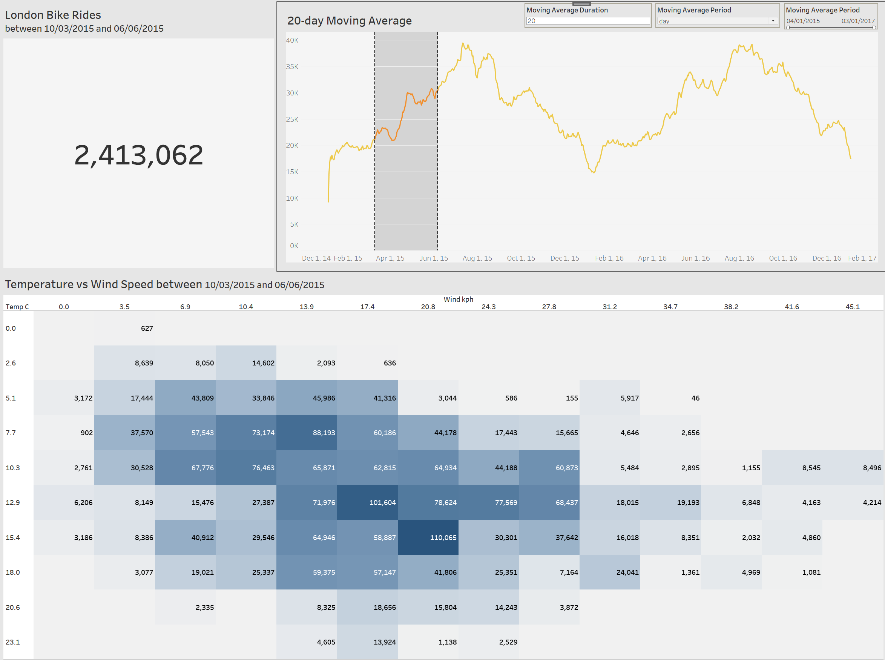

# Overview

A Data Visualization project done with Python and Tableau, which highlights ride count in terms of temperatures vs wind speed, a moving average of ride count, and total ride. 

# Problem Statement

* Determine how factors like temperate and wind speed affect the number of bike rides within a given period of time

# Dashboard Features

* User parameters
    - Moving Average duration in days
    - Period interval (i.e. day, week, month)
    - Date range/timeframe
* Dynamically set periods for all charts via set actions
* Moving Average chart
* Total rides
* Heat map of Temperature vs Wind Speed and how they affect total bike rides
